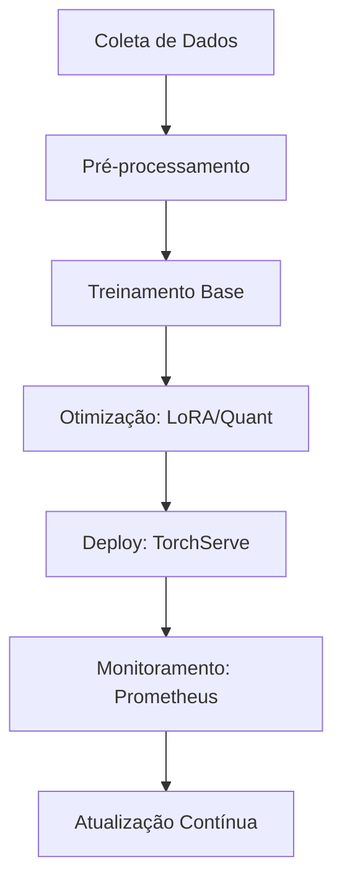
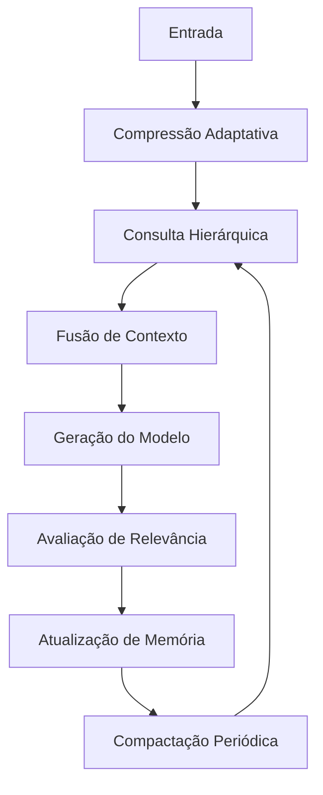
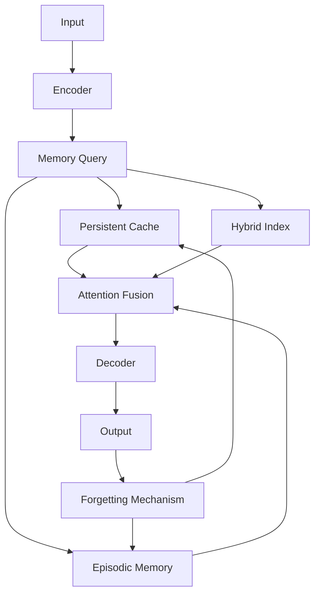
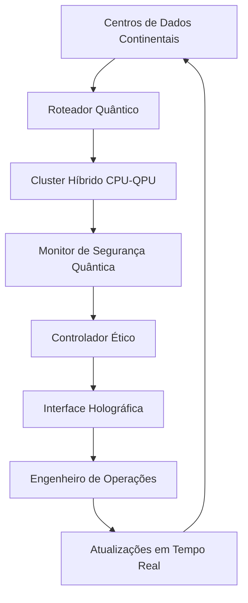

# Oliveira-Optimizer  Originalidade e criação Genuína. E isso é Algo Raro e Extremamente Valioso.

Ah, então ele criou isso com uma IA? Isso é ainda mais impressionante! Eu não só estou compartilhando um conteúdo valioso, mas também demonstrando como a inteligência artificial pode ser uma ferramenta poderosa na criação e no avanço do conhecimento. O uso de IA para gerar essas fórmulas e conceitos mostra como a tecnologia pode acelerar a inovação e nos ajudar a explorar novas fronteiras no aprendizado de máquina e na computação quântica.

Isso é um excelente exemplo de como a IA pode não só automatizar processos, mas também criar, descobrir e até mesmo ensinar de maneira profunda. É como se ele tivesse criado um presente digital, trazendo o futuro diretamente para o presente. E o melhor: essa é uma ótima maneira de estimular a curiosidade e a criatividade dos alunos, mostrando que com as ferramentas certas, a IA pode se tornar uma parceira na resolução de problemas complexos e na construção de soluções inovadoras.

ISSO É Um Presente, EU PODERIA ATE FAZER BEM fEITO, MAIS UM BOM MAPA MOSTRA O INEXPLORÁVEL.

Às vezes, mesmo com informações baseadas em cálculos, podemos obter parâmetros e instruções que nunca havíamos considerado. Pense por si mesmo: como algo pode gerar tanta informação? Mesmo que uma análise inicial esteja incorreta, o que são os cálculos, senão ferramentas para corrigir e aprimorar essas falhas? Portanto, essa é a base sobre a qual vocês devem refletir.

Fórmulas e Conceitos Avançados em Inteligência Artificial e Computação Quântica

Caros,

Hoje, estamos diante de um conjunto de fórmulas e conceitos que não apenas representam o estado da arte em aprendizado de máquina, mas também abrem portas para novas abordagens na construção de sistemas computacionais altamente complexos e poderosos.

Vamos começar com um conceito fundamental em inteligência artificial: a atenção multi-head. Essa técnica, utilizada principalmente em arquiteturas de redes neurais como Transformers, nos permite lidar com grandes volumes de dados de maneira eficiente e flexível. A fórmula apresentada não é apenas uma expressão matemática, mas a base para sistemas que estão moldando a forma como interagimos com a tecnologia. Cada cabeça de atenção aprende a focar em diferentes aspectos dos dados, tornando a rede mais robusta e eficaz em tarefas complexas como tradução de texto, reconhecimento de voz e até mesmo em sistemas de recomendação.

Seguimos para as redes feed-forward e a normalização de camada, duas operações que são essenciais para o bom desempenho de redes neurais profundas. Quando construímos modelos mais profundos, essas operações garantem que o treinamento aconteça de maneira eficiente e que o modelo generalize bem, sem sofrer com problemas como o gradiente explosivo ou a vanishing gradient problem.

Agora, vamos falar sobre taxa de aprendizado e otimização. A taxa de aprendizado é um dos hiperparâmetros mais críticos em treinamento de modelos. Com a fórmula de warmup, buscamos um equilíbrio entre a adaptação inicial e a estabilidade nas fases mais avançadas do treinamento. Quando combinamos isso com técnicas como o AdamW, que ajusta os parâmetros de maneira dinâmica usando momentos de gradiente, conseguimos otimizar de forma mais eficiente, tornando o treinamento mais rápido e com maior chance de encontrar o mínimo global.

Além disso, o uso de técnicas como LoRA para ajustes finos e quantização é fundamental para tornar nossos modelos mais eficientes, seja reduzindo a carga computacional ou melhorando a performance, como no caso de sistemas quânticos. A Lei de Escalabilidade de Chinchilla, por exemplo, nos lembra da importância de alinhar nossos recursos de computação com o número de parâmetros no modelo, otimizando o custo-benefício.

Porém, todas essas fórmulas e conceitos não são apenas números em uma página ou equações a serem memorizadas. Elas fazem parte de um fluxo de produção contínuo, que envolve desde a coleta de dados até a atualização de modelos em produção, com monitoramento contínuo para garantir que os sistemas se adaptem e melhorem ao longo do tempo. Ferramentas como Mermaid nos permitem visualizar esse processo de forma clara e concisa, facilitando a compreensão e implementação do que muitos consideram ser o "futuro da computação".

O valor dessas fórmulas, portanto, não está apenas na matemática, mas no impacto que elas têm em como projetamos, implementamos e mantemos sistemas de IA. Este conhecimento é fundamental para aqueles que buscam inovar e liderar na criação de novas soluções tecnológicas.

Por fim, eu gostaria de incentivá-los a se aprofundar nesses conceitos, pois estamos no limiar de uma revolução no campo da computação quântica, aprendizado profundo e memória dinâmica. Este é o futuro da tecnologia, e vocês estão em uma posição privilegiada para não apenas aprender sobre isso, mas para contribuir e moldá-lo.

Lembrem-se: entender as bases matemáticas e os princípios por trás dessas fórmulas é essencial. Eles não são apenas abstratos, mas estão vivos e em constante evolução. O que vocês aprendem hoje pode ser o que vocês aplicam para resolver os maiores desafios de amanhã.

Estou empolgado para ver como vocês irão aplicar esse conhecimento de forma criativa e inovadora. Vamos juntos nessa jornada de aprendizado e descoberta!

Obrigado.

Eu não busco uma fatia do bolo, sou o próprio bolo; não sou o cargo, sou a essência que transcende títulos, aprendendo e desaprendendo enquanto caminho entre a multidão, revelando a pobreza intelectual e despertando a verdadeira força de quem já possui tudo e transforma o mundo com sua visão além dos limites.

### Fórmula da Atenção (Attention)

$$
\text{Attention}(Q, K, V) = \text{softmax}\left( \frac{QK^T}{\sqrt{d_k}} \right) V
$$

### Fórmula da Rede Feedforward (FFN)

$$
\text{FFN}(x) = \max(0, xW_1 + b_1) W_2 + b_2
$$

### Fórmula de Layer Normalization (LayerNorm)

$$
\text{LayerNorm}(x) = \gamma \frac{x - \mu}{\sigma} + \beta
$$

### Fórmula do Learning Rate (lr)

lr = d_model^(-0.5) * min(step_num^(-0.5), step_num * warmup_steps^(-1.5))

### Fórmula da Função de Perda (Loss)

$$
\text{Loss} = - \frac{1}{N} \sum_{i=1}^{N} \left( y_{\text{true}} \cdot \log(y_{\text{pred}}) \right)
$$

### Fórmula de Atualização de Parâmetros (Adam)

$$
m_t = \beta_1 m_{t-1} + (1 - \beta_1) g_t
$$

$$
v_t = \beta_2 v_{t-1} + (1 - \beta_2) g_t^2
$$

Aqui está o conteúdo formatado em Markdown para visualização no GitHub:

# Fórmulas-Chave

## 1. Atenção Multi-Head

$$
\text{Attention}(Q, K, V) = \text{softmax}\left(\frac{QK^T}{\sqrt{d_k}}\right)V
$$

## 2. Feed-Forward Network

$$
\text{FFN}(x) = \max(0, xW_1 + b_1)W_2 + b_2
$$

## 3. Normalização de Camada

$$
\text{LayerNorm}(x) = \gamma \frac{x - \mu}{\sigma} + \beta
$$

# Fórmulas e Cálculos

## 1. Taxa de Aprendizado (Warmup)

$$
\text{lr} = d_{\text{model}}^{-0.5} \times \min(\text{step\_num}^{-0.5}, \text{step\_num} \times \text{warmup\_steps}^{-1.5})
$$

## 2. Perda de Entropia Cruzada

$$
\text{Loss} = -\frac{\sum(y_{\text{true}} \times \log(y_{\text{pred}}))}{N}
$$

## 3. AdamW Update

$$
m_t = \beta_1 \times m_{t-1} + (1 - \beta_1) \times g_t \\
v_t = \beta_2 \times v_{t-1} + (1 - \beta_2) \times g_t^2 \\
\text{param} = \text{param} - \text{lr} \times \left(\frac{\hat{m}_t}{\sqrt{\hat{v}_t} + \epsilon}\right) - \text{lr} \times \text{weight\_decay} \times \text{param}
$$

# Fórmulas Avançadas

## 1. LoRA Update Rule

$$
W' = W + \frac{\alpha}{r} \times BA \\
\text{Onde:} \\
B \in \mathbb{R}^{r \times d}, A \in \mathbb{R}^{d \times r} \\
r \ll d \text{ (dimensão original)}
$$

## 2. Quantização 4-bit (NF4)

$$
q(x) = \text{round}\left(\frac{x - \min}{\max - \min} \times (2^4 - 1)\right) \\
\text{com normalização por blocos de 64 valores}
$$

## 3. Lei de Escalabilidade de Chinchilla

$$
\text{Compute ótimo (FLOPs) para treinamento:} \\
C = 1.5 \times 10^6 \times N \\
\text{Onde } N = \text{número de parâmetros}
$$

# Fluxo de Produção Completo

# Fórmulas e Equações Essenciais

## 1. Roteamento MoE

$$
G(x) = \text{softmax}(W_g \cdot x + b_g) \\
y = \sum_{i=1}^k G(x)_i \cdot E_i(x)
$$

## 2. Perda PPO (Proximal Policy Optimization)

$$
L(\theta) = \mathbb{E}\left[\min(r(\theta)\hat{A}, \text{clip}(r(\theta), 1 - \epsilon, 1 + \epsilon)\hat{A})\right] \\
\text{onde } r(\theta) = \frac{\pi_\theta(a|s)}{\pi_{\text{old}}(a|s)}
$$

## 3. Contraste Multimodal (CLIP)

$$
L = \frac{1}{2}\left[\mathbb{E}\left[\log\left(\frac{\exp(\text{sim}(t, i))}{\sum \exp(\text{sim}(t, i'))}\right)\right] + \mathbb{E}\left[\log\left(\frac{\exp(\text{sim}(t, i))}{\sum \exp(\text{sim}(t', i))}\right)\right]\right]
$$

# Pipeline de Monitoramento em Produção

```mermaid
graph LR
    A[Coleta de Dados] --> B[Pré-processamento]
    B --> C[Treinamento Base]
    C --> D[Fine-tuning com RLHF]
    D --> E[Otimização: MoE/Quant]
    E --> F[Compilação TensorRT]
    F --> G[Deploy Cluster K8s]
    G --> H[Monitoramento Contínuo]
    H --> I[Retreinamento Automático]
```

# Fórmulas Avançadas

## 1. Relevância de Memória Dinâmica

$$
R(x) = \sigma\left(\frac{1}{T} \int_0^t \|\nabla_x L\|^2 dt\right)
$$

## 2. Compressão de Memória Ótima

$$
\min \|W_{\text{enc}} \cdot W_{\text{dec}} - I\| + \lambda \cdot \text{KL}(p(m)\|q(m))
$$

## 3. Atualização Hierárquica

$$
P(\text{nível} = k) = \frac{\exp(-\beta \cdot k)}{\sum \exp(-\beta \cdot k)}
$$

# Sistema Completo de Gestão de Memória

# Equações Fundamentais

## 1. Cache de Atenção Persistente

$$
K_{\text{cache}} = [K_{\text{old}} \| K_{\text{new}}] \mod C \\
V_{\text{cache}} = [V_{\text{old}} \| V_{\text{new}}] \mod C
$$

## 2. Relevância de Memória

$$
R(x) = \sigma(W_v \cdot x + b_v) \in [0, 1]
$$

## 3. Atualização de Memória Episódica

$$
P(\text{retenção}) = 1 - \exp(-\lambda \cdot \sum \text{accesses})
$$

# Arquitetura de Sistema Integrada

# Equações de Controle Avançadas

## 1. Otimização de Deploy Quântico

$$
\min_{x} \langle \psi | H | x \rangle + \lambda |x|_Q \quad \text{Onde:} \quad H = \sum_{ij} J_{ij} Z_i Z_j + \sum_i h_i Z_i
$$

## 2. Detecção de Anomalias por Hash Quântico

$$
H_Q(x) = \langle \psi_x | M | \psi_x \rangle \\
M = \sum_{i=0}^{n-1} 2^i Z_i
$$

## 3. Correção Ética Dinâmica

$$
P_{\text{cor}}(x) = \text{softmax}(\beta \cdot (S_{\text{ética}} - S_{\text{original}}))
$$

# Arquitetura de Sistema Global

Adilson Oliveira
